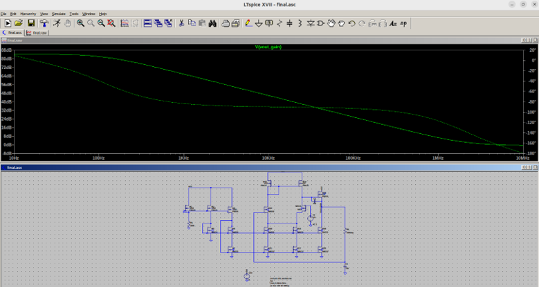
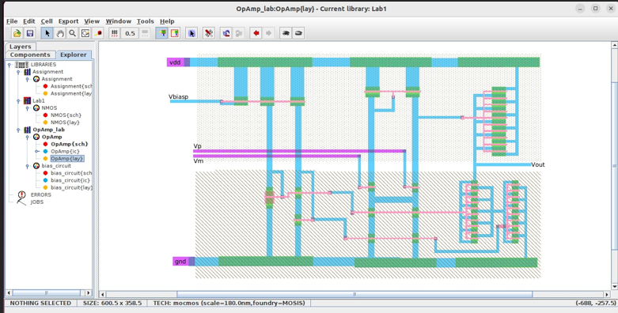

# 📘 Thiết kế mạch Op-Amp sử dụng công nghệ CMOS

## 🎓 Giới thiệu

Đây là bài tập lớn môn học liên quan đến thiết kế vi mạch tương tự, với mục tiêu thiết kế và mô phỏng **mạch khuếch đại thuật toán (Operational Amplifier – Op-Amp)** bằng công nghệ **CMOS**, sử dụng công cụ **Electric VLSI** và **LTspice**.

---

## 🧠 Mục tiêu

- Hiểu nguyên lý và cấu trúc ba tầng của mạch Op-Amp: khuếch đại vi sai, khuếch đại trung gian, và tầng đệm.
- Thiết kế schematic và layout trên Electric VLSI.
- Gán các tham số công nghệ, viết mã SPICE và mô phỏng AC, TRAN để đánh giá hiệu suất mạch.
- Tối ưu layout để pass các kiểm tra DRC, LVS.

---

## 🧩 Cấu trúc mạch

### Tầng 1 – Vi sai đầu vào:
- **Transistor**: NMOS M5, M6; PMOS M1, M2, M3; NMOS M7
- **Chức năng**: So sánh tín hiệu Vp và Vm, tạo ra tín hiệu vi sai khuếch đại đầu tiên.

### Tầng 2 – Khuếch đại trung gian:
- **Transistor**: M13, M14, M15, M10–M12
- **Chức năng**: Khuếch đại mạnh hơn tín hiệu và tạo dòng thiên ổn định.

### Tầng 3 – Đệm đầu ra:
- **Transistor**: M18, M19, M20
- **Chức năng**: Đảm bảo tín hiệu đầu ra đủ công suất kéo tải, giảm trở kháng.

### Khối Bias – Cấp dòng phân cực:
- **Transistor**: M7, M10–M12, M16–M17
- **Chức năng**: Tạo mirror current giữ ổn định dòng, giúp mạch hoạt động ổn định.

---

## 🛠️ Công cụ sử dụng

| Công cụ         | Mục đích                              |
|------------------|----------------------------------------|
| Electric VLSI    | Thiết kế schematic & layout            |
| LTspice          | Mô phỏng AC, TRAN                      |

## 📊 Kết quả mô phỏng

- **TRAN (.tran)**: Với Vp = Vm = 2.5V → Vout ổn định ~2.5015V
- **AC (.ac dec 100 10 10Meg)**:
  - Gain ~88 dB
  - Băng thông ~1–2 MHz
- **Tại 100.9 Hz**: Gain ~38.3 dB
- **Bandwidth (–3 dB)**: ~2.738 kHz

---

## 📐 Layout

- PMOS bố trí phía trên (trong N-well), NMOS phía dưới.
- DRC/LVS đạt yêu cầu.
- Matching tốt, tối ưu kim loại, via.
- Chân tín hiệu bố trí logic, phù hợp tích hợp chip.

---

## 📌 Kết luận

- Mạch CMOS Op-Amp cho kết quả tốt về gain, băng thông và ổn định.
- Thiết kế đáp ứng tốt cho các ứng dụng khuếch đại tín hiệu yếu.
- Có thể dùng trong cảm biến, mạch lọc, khối đầu vào ADC, v.v.

